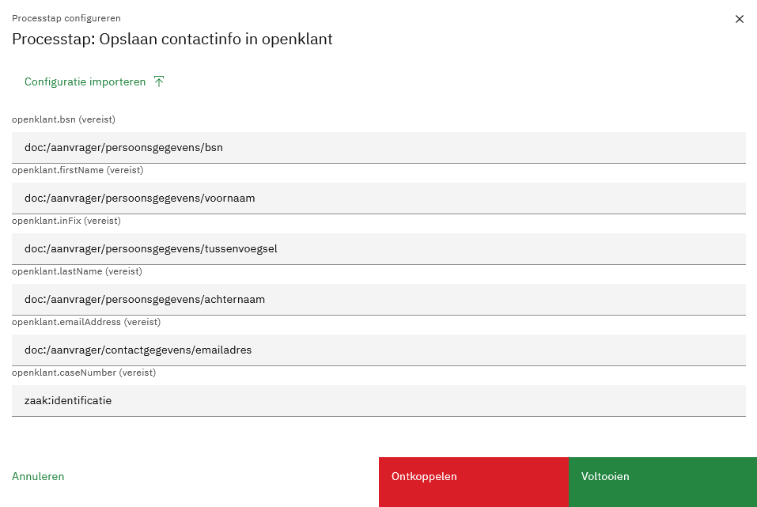
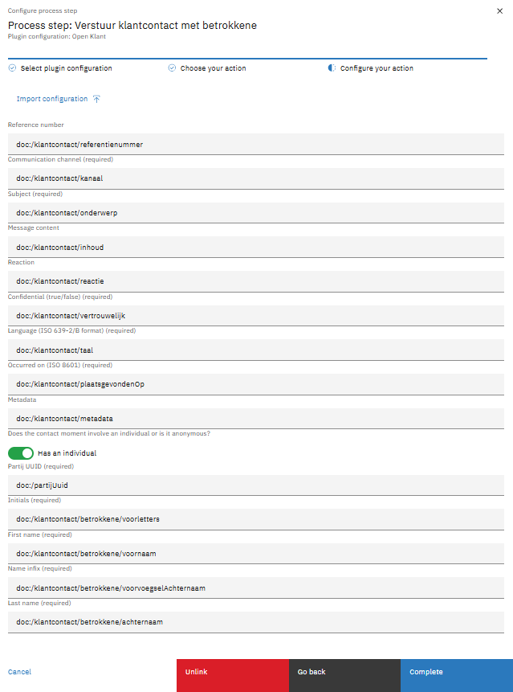
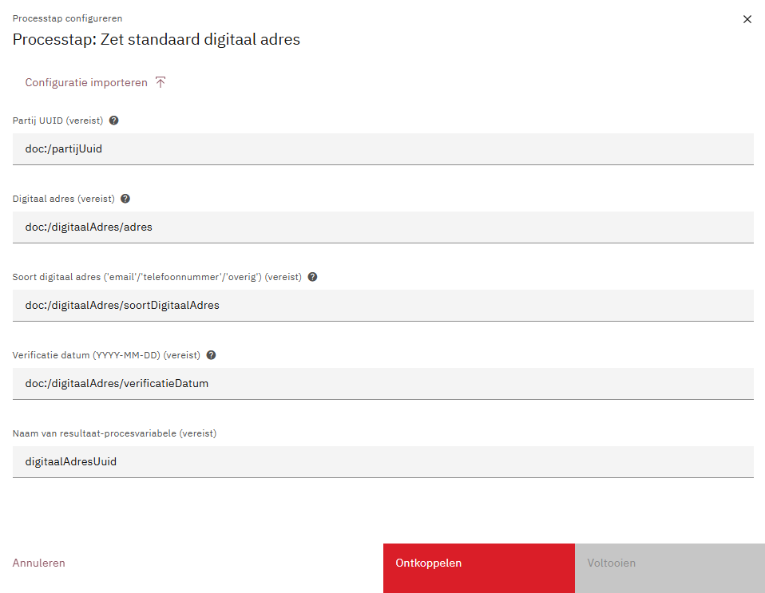
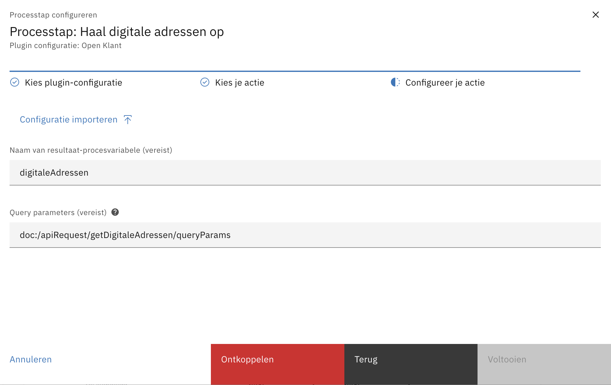
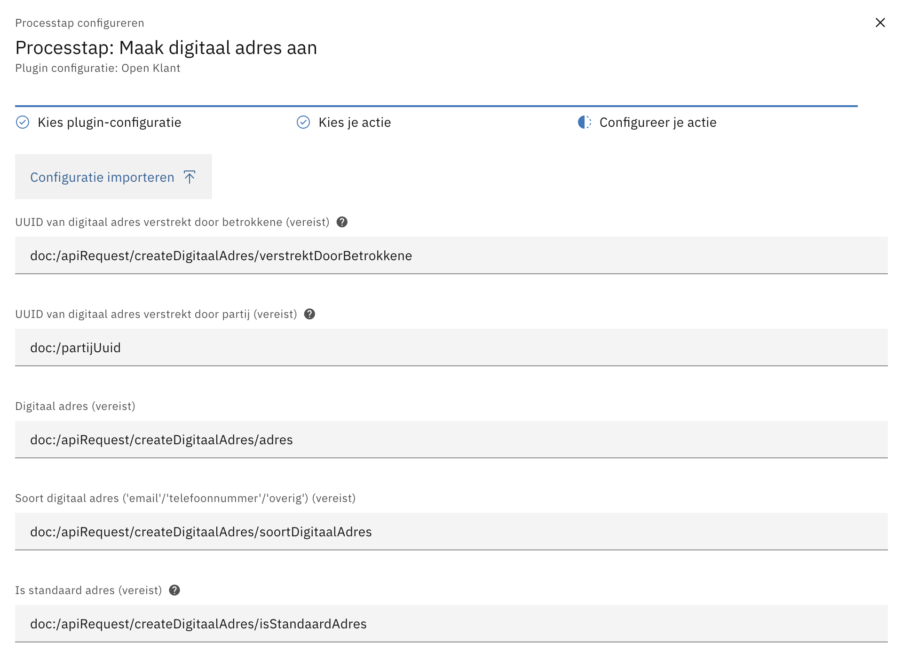
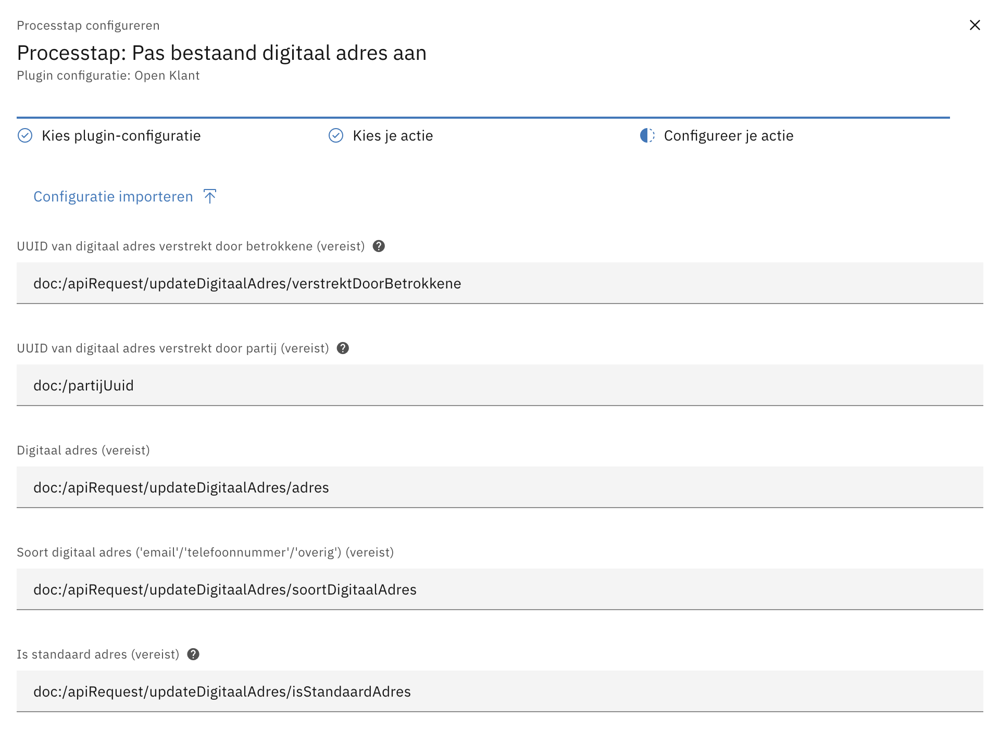
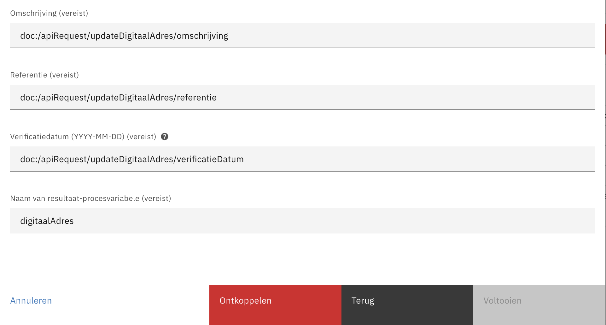
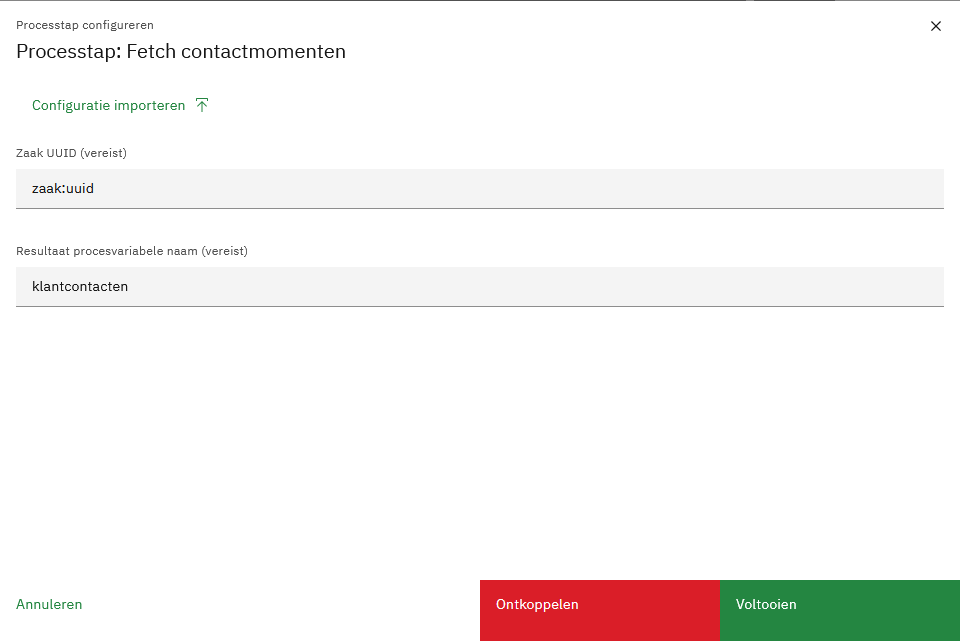
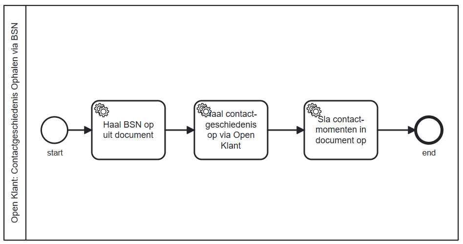

# Open Klant

## Omschrijving

De Open Klant plug-in verzorgt:

- Plug-in acties:
    - Het opslaan van partij op basis van voor- en achternaam, e-mailadres, bsn en zaaknummer.
    - Het ophalen van klantcontacten
- Value resolver:
    - `klant:klantcontacten`
    - `klant:klantcontactenOrNull`
- Custom tabblad component:
    - Het tonen van klantcontacten

Het communiceert met een Open Klant (v2) implementatie.

## Plug-in properties:

* Open Klant klantinteracties URL (_bv. https://openklant.gemeente.nl/klantinteracties/api/v1/_)

* Open Klant Token

Een algemene beschrijving van het configureren van plug-ins vind je
hier:[https://docs.valtimo.nl/features/plugins#configuring-plugins](https://docs.valtimo.nl/features/plugins#configuring-plugins)

De configuratie kan ook worden geautodeployed. Voorbeeld `*.pluginconfig.json`:

```json   
{
  "id": "12023724-a4bd-431d-93c0-5ba52049e9cd",
  "title": "Open Klant",
  "pluginDefinitionKey": "openklant",
  "properties": {
    "klantinteractiesUrl": "https://openklant.gemeente.nl/klantinteracties/api/v1/",
    "token": "${OPENKLANT_AUTHORIZATION_TOKEN}"
  }
}   
```

Elke waarde kan een `${ENV_VARIABELE}`-placeholder zijn. Gebruik dit voor het token, zodat het niet in de repository
terechtkomt.

## Opslaan partij:



Voorbeeld `*.processlink.json`:

```json
{
  "activityId": "Activity_OpslaanPartij",
  "activityType": "bpmn:ServiceTask:start",
  "pluginConfigurationId": "12023724-a4bd-431d-93c0-5ba52049e9cd",
  "pluginActionDefinitionKey": "store-contact-info",
  "actionProperties": {
    "bsn": "doc:/persoonsgegevens/bsn",
    "firstName": "doc:/persoonsgegevens/voornaam",
    "inFix": "doc:/persoonsgegevens/tussenvoegsel",
    "lastName": "doc:/persoonsgegevens/achternaam",
    "emailAddress": "doc:/contactgegevens/emailadres",
    "caseNumber": "zaak:identificatie"
  },
  "processLinkType": "plugin"
}
```

## Versturen van klantcontact


Voorbeeld `*.processlink.json`
```json
{
  "activityId": "verstuurKlantcontact",
  "activityType": "bpmn:ServiceTask:start",
  "pluginConfigurationId": "12023724-a4bd-431d-93c0-5ba52049e9cd",
  "pluginActionDefinitionKey": "register-klantcontact",
  "actionProperties": {
    "hasBetrokkene": true,
    "kanaal": "doc:/klantcontact/kanaal",
    "onderwerp": "doc:/klantcontact/onderwerp",
    "inhoud": "doc:/klantcontact/inhoud",
    "vertrouwelijk": "doc:/klantcontact/vertrouwelijk",
    "taal": "doc:/klantcontact/taal",
    "plaatsgevondenOp": "doc:/klantcontact/plaatsgevondenOp",
    "partijUuid": "doc:/klantcontact/betrokkene/partijUuid",
    "voorletters": "doc:/klantcontact/betrokkene/voorletters",
    "voornaam": "doc:/klantcontact/betrokkene/voornaam",
    "voorvoegselAchternaam": "doc:/klantcontact/betrokkene/voorvoegselAchternaam",
    "achternaam": "doc:/klantcontact/betrokkene/achternaam"
  },
  "processLinkType": "plugin"
}
```

zonder betrokkene:
```json
{
  "activityId": "verstuurKlantcontactZonderBetrokkene",
  "activityType": "bpmn:ServiceTask:start",
  "pluginConfigurationId": "12023724-a4bd-431d-93c0-5ba52049e9cd",
  "pluginActionDefinitionKey": "register-klantcontact",
  "actionProperties": {
    "hasBetrokkene": false,
    "kanaal": "doc:/klantcontact/kanaal",
    "onderwerp": "doc:/klantcontact/onderwerp",
    "inhoud": "doc:/klantcontact/inhoud",
    "vertrouwelijk": "doc:/klantcontact/vertrouwelijk",
    "taal": "doc:/klantcontact/taal",
    "plaatsgevondenOp": "doc:/klantcontact/plaatsgevondenOp"
  },
  "processLinkType": "plugin"
}
```
## Instellen van standaard digitaal adres

Bij het instellen van een standaard digitaal adres wordt het volgende gedaan:
- Er wordt een nieuw digitaal adres aangemaakt
- Dit adres krijgt de referentie "PortaalVoorkeur"
- Het adres wordt aangevinkt als standaardadres
- Bij bestaande adressen van hetzelfde soort wordt de referentie "PortaalVoorkeur" verwijderd

Voorbeeld `*.processlink.json`
```json
    {
  "activityId": "zetStandaardDigitaalAdres",
  "activityType": "bpmn:ServiceTask:start",
  "pluginConfigurationId": "12023724-a4bd-431d-93c0-5ba52049e9cd",
  "pluginActionDefinitionKey": "set-default-digitaal-adres",
  "actionProperties": {
    "resultPvName": "digitaalAdresUuid",
    "partijUuid": "doc:/partijUuid",
    "adres": "doc:/apiRequest/setDefaultDigitaalAdres/apiRequest/adres",
    "soortDigitaalAdres": "doc:/apiRequest/setDefaultDigitaalAdres/soortDigitaalAdres",
    "verificatieDatum": "doc:/apiRequest/setDefaultDigitaalAdres/verificatieDatum"
  },
  "processLinkType": "plugin"
}
```

## Digitale Adressen ophalen


Hiermee kan een lijst van digitale adressen opgehaald worden. 

Het `resultPvName`-veld is verplicht, maar ook het gebruik van `queryParams` wordt sterk aangeraden. De response kan zonder `queryParams` erg groot kan worden. Om het verwerken van de response-data in Valtimo simpel om mee te werken te houden, wordt er namelijk geen paginatie toegepast door de plugin.

`queryParams` moeten als volgt geformatteerd worden:
```json
[
  {
    "key": "verstrektDoorPartij__partijIdentificator__objectId",
    "value": "053799793"
  },
  {
    "key": "soortDigitaalAdres",
    "value": "email"
  }
  
]
```
In dit bovenstaande voorbeeld wordt gefilterd op een specifiek `verstrektDoorPartij__partijIdentificator__objectId`, oftewel BSN, en op het `email`-adrestype. Zie voor een complete lijst van mogelijk queryParams <a href='https://redocly.github.io/redoc/?url=https://raw.githubusercontent.com/maykinmedia/open-klant/2.16.0/src/openklant/components/klantinteracties/openapi.yaml#tag/digitale-adressen/operation/digitaleadressenList' target='_blank'>de Open-Klant-API-docs</a>. 

Hieronder een voorbeeld van een proceskoppeling voor het ophalen van digitale adressen:

```json
{
  "activityId": "haalDigitaleAdressenOp",
  "activityType": "bpmn:ServiceTask:start",
  "pluginConfigurationId": "12023724-a4bd-431d-93c0-5ba52049e9cd",
  "pluginActionDefinitionKey": "get-digitale-adressen",
  "actionProperties": {
    "resultPvName": "digitaleAdressen",
    "queryParams": "doc:/apiRequest/getDigitaleAdressen/queryParams"
  },
  "processLinkType": "plugin"
}
```

## Digitaal Adres aanmaken


Een nieuw digitaal adres kan worden aangemaakt met de onderstaande proceskoppeling. De volgende velden zijn verplicht:
- `resultPvName` (in deze procesvariabele wordt het resultaat opgeslagen)
- `adres`
- `soortDigitaalAdres` (`email`, `telefoonnummer` of `overig`)

```json
{
  "activityId": "maakDigitaalAdresAan",
  "activityType": "bpmn:ServiceTask:start",
  "pluginConfigurationId": "12023724-a4bd-431d-93c0-5ba52049e9cd",
  "pluginActionDefinitionKey": "create-digitaal-adres",
  "actionProperties": {
    "resultPvName": "digitaalAdres",
    "verstrektDoorBetrokkene": "doc:/apiRequest/createDigitaalAdres/verstrektDoorBetrokkene",
    "verstrektDoorPartij": "doc:/partijUuid",
    "adres": "doc:/apiRequest/createDigitaalAdres/adres",
    "soortDigitaalAdres": "doc:/apiRequest/createDigitaalAdres/soortDigitaalAdres",
    "isStandaardAdres": "doc:/apiRequest/createDigitaalAdres/isStandaardAdres",
    "omschrijving": "doc:/apiRequest/createDigitaalAdres/omschrijving",
    "referentie": "doc:/apiRequest/createDigitaalAdres/referentie",
    "verificatieDatum": "doc:/apiRequest/createDigitaalAdres/verificatieDatum"
  },
  "processLinkType": "plugin"
}
```
## Digitaal Adres aanpassen



De enige velden die verplicht zijn: 
- `resultPvName` (in deze procesvariabele wordt het resultaat opgeslagen)
- `digitaalAdresUuid` (de UUID van het Digitaal Adres dat je wilt aanpassen)

Verder is het natuurlijk logisch dat er een veld wordt megegeven met data die moet worden aangepast, maar dit is, om flexibel te blijven, niet verplicht.

```json
{
  "activityId": "pasBestaandDigitaalAdresAan",
  "activityType": "bpmn:ServiceTask:start",
  "pluginConfigurationId": "12023724-a4bd-431d-93c0-5ba52049e9cd",
  "pluginActionDefinitionKey": "update-digitaal-adres",
  "actionProperties": {
    "resultPvName": "digitaalAdres",
    "digitaalAdresUuid": "doc:/digitaalAdresUuid",
    "verstrektDoorBetrokkene": "doc:/apiRequest/updateDigitaalAdres/verstrektDoorBetrokkene",
    "verstrektDoorPartij": "doc:/partijUuid",
    "adres": "doc:/apiRequest/updateDigitaalAdres/adres",
    "soortDigitaalAdres": "doc:/apiRequest/updateDigitaalAdres/soortDigitaalAdres",
    "isStandaardAdres": "doc:/apiRequest/updateDigitaalAdres/isStandaardAdres",
    "omschrijving": "doc:/apiRequest/updateDigitaalAdres/omschrijving",
    "referentie": "doc:/apiRequest/updateDigitaalAdres/referentie",
    "verificatieDatum": "doc:/apiRequest/updateDigitaalAdres/verificatieDatum"
  },
  "processLinkType": "plugin"
}
```

## Contactgeschiedenis
Contactgeschiedenis kan op drie manieren worden opgehaald:
- Via de Open Zaak zaaknummer (UUID)
- Via BSN
- Via de Partijnummer (UUID) uit Open Klant

### Ophalen klantcontacten (contactgeschiedenis) via BSN: plugin-actie:

Voorbeeld-`[...].processlink.json`-bestand:

```json
{
  "activityId": "Activity_HaalContactgeschiedenisOpTask",
  "activityType": "bpmn:ServiceTask:start",
  "id": "80ca9599-35bc-4220-b218-4500df2f2f91",
  "pluginConfigurationId": "12023724-a4bd-431d-93c0-5ba52049e9cd",
  "pluginActionDefinitionKey": "get-contact-moments-by-bsn",
  "actionProperties": {
      "bsn": "pv:bsn",
      "resultPvName": "contactgeschiedenis"
  },
  "processLinkType": "plugin"
}
```

### Ophalen klantcontacten via Partij UUID
Voorbeeld-`[...].processlink.json`-bestand:
```json
{
  "activityId": "Activity_HaalContactgeschiedenisOpTask",
  "activityType": "bpmn:ServiceTask:start",
  "id": "80ca9599-35bc-4220-b218-4500df2f2f91",
  "pluginConfigurationId": "12023724-a4bd-431d-93c0-5ba52049e9cd",
  "pluginActionDefinitionKey": "get-contact-moments-by-partij-uuid",
  "actionProperties": {
      "partijUuid": "pv:partijUuid",
      "resultPvName": "contactgeschiedenis"
  },
  "processLinkType": "plugin"
}
```
### Ophalen klantcontacten (contactgeschiedenis) via Open-Zaaknummer (UUID): plugin-actie:



Voorbeeld `*.processlink.json`:

```json
{
  "activityId": "Activity_OphalenKlantcontacten",
  "activityType": "bpmn:ServiceTask:start",
  "pluginConfigurationId": "12023724-a4bd-431d-93c0-5ba52049",
  "pluginActionDefinitionKey": "get-contact-moments-by-case",
  "actionProperties": {
    "objectUuid": "zaak:uuid",
    "resultPvName": "klantcontacten"
  },
  "processLinkType": "plugin"
}
```

#### Ophalen klantcontacten via Open-Zaaknummer (UUID): value resolver:
Klantcontacten via Zaak UUID kunnen ook worden opgehaald via een value resolver.
Hiervoor zijn twee mogelijkheden:

- `klant:klantcontacten`: Haalt contactgeschiedenis op basis van zaak uuid, als er geen klantcontacten is, dan wordt er een lege lijst doorgegeven.
- `klant:klantcontactenOrNull` : Haalt contactgeschiedenis op basis van zaak uuid, als er geen klantcontacten is, dan wordt `null` doorgegeven.

### Implementatie contactgeschiedenis tabblad

#### Frontend
In de frontend moet de volgende waarden toegevoegd worden:

```typescript
@NgModule({
    declarations: [AppComponent,],
    imports: [
        //...
        OpenKlantPluginModule,
    ],
    providers: [
        {
            provide: PLUGINS_TOKEN, useValue: [
                //...
                openKlantPluginSpecification,],
        },
        {
            provide: CASE_TAB_TOKEN,
            useValue: {
                "generieke-contactgeschiedenis": ContactHistoryTabComponent, // voeg deze alleen toe als je het contactgeschiedenistabblad wilt gebruiken.
            }
        }
    ],
    //...
})
```

#### Tabblad Config
Onder `config/case/[...]/case/tab/[...].case-tab.json` kan het tabblad worden gekoppeld aan het dossier
```json
{
    "changesetId": "open-klant.case-tabs.1768982327099",
    "case-definitions": [
        {
            "key": "open-klant",
            "tabs": [
                {
                    "key": "contactgeschiedenis",
                    "name": "Contactgeschiedenis",
                    "type": "custom",
                    "contentKey": "generieke-contactgeschiedenis"
                }
            ]
        }
    ]
}
```

_Zie [toevoegen van plugins](https://docs.valtimo.nl/features/plugins/plugins/custom-plugin-definition#adding-the-plugin-module-to-the-ngmodule) en [toevoegen van case tabs](https://docs.valtimo.nl/features/case/for-developers/case-tabs) in de Valtimo docs._

#### Tabblad BPMN
Wanneer het tabblad wordt ingeladen, wordt het process met de id `contactgeschiedenis-ophalen` opgestart. 
Dit process moet zelf in de configuratie gemaakt worden. Het is belangrijk dat in het process, de contactgeschiedenis in een dossiervariabele wordt geplaatst onder: `doc:/contactgeschiedenis`.
Deze moet ook worden toegevoegd aan de dossierdefinitie: 
```json
{
  "$id": "open-klant.schema",
  "type": "object",
  "title": "Open Klant",
  "$schema": "http://json-schema.org/draft-07/schema#",
  "properties": {
    "contactgeschiedenis": {
      "type": "array",
      "items": {
        "properties": {}
      },
      "default": []
    }
  },
  "additionalProperties": false
}

```

`config/case/[...]/case/bpmn/contactgeschiedenis-ophalen.bpmn` is een voorbeeld hoe de BPMN eruit kan zien.



#### Een custom theme gebruiken voor het Contactgeschiedenistabblad

Per default wordt er in `contact-history-tab.component.scss` het thema van Carbon gebruikt. Als je jouw eigen override van dit thema wilt gebruiken, uncomment dan simpelweg de regel `@use '/my/carbon/theme/override`, en zorg dat de path naar jouw thema wijst. 

Het onderstaande codefragment is te vinden in `openklant/src/lib/tab/contact-history/components/contact-history-tab/contact-history-tab.component.spec.ts`:
```scss
@use '@carbon/styles/scss/themes';

// Optionally use your own, custom theme:
// @use '/my/carbon/theme/override';

// See: https://docs.valtimo.nl/customizing-valtimo/front-end-customization/customizing-carbon-theme
```
